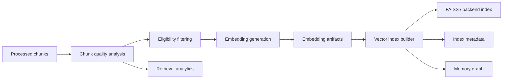
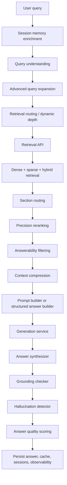
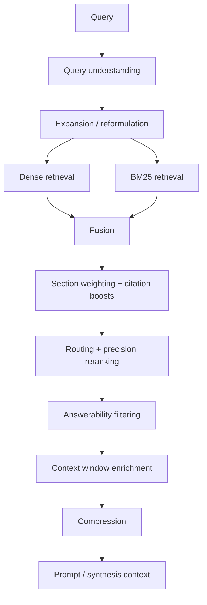
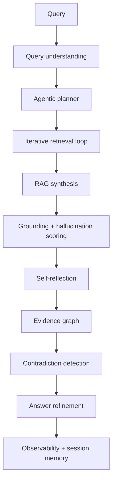
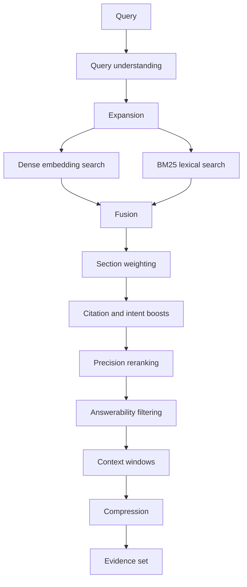
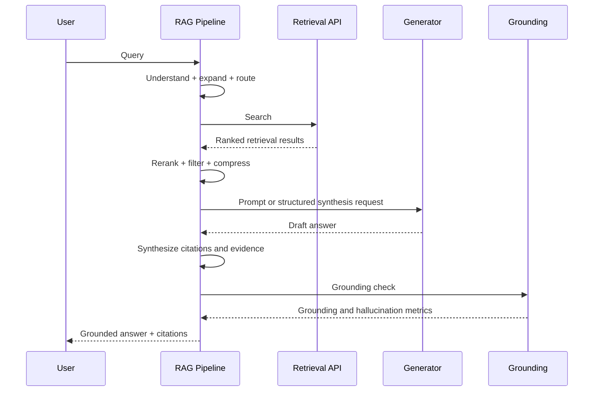
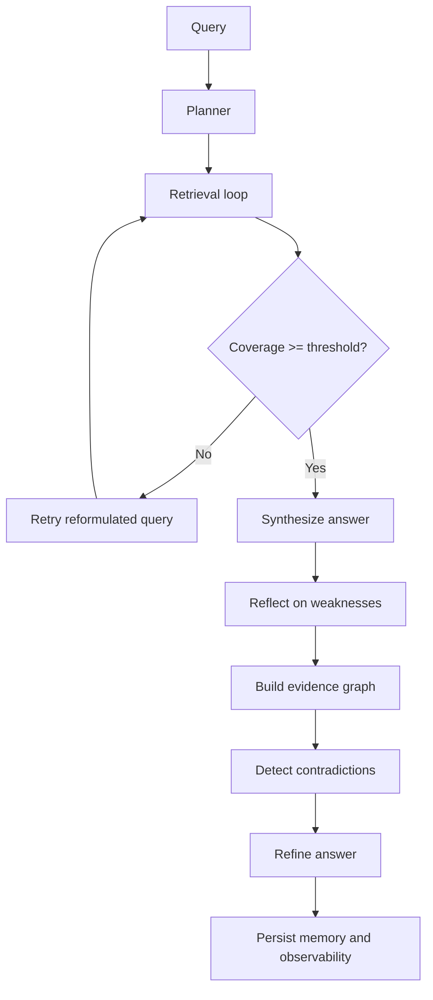
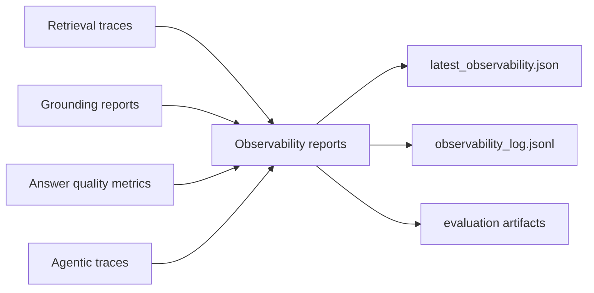
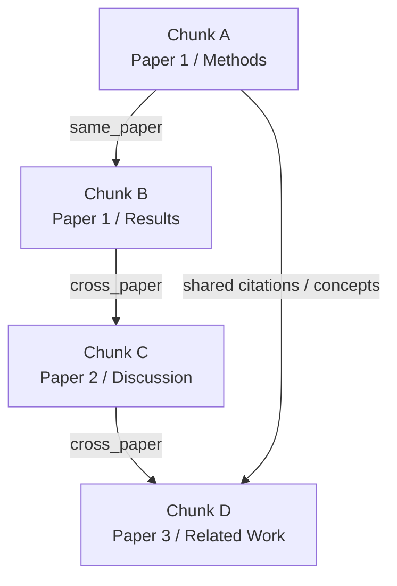

# Autonomous Research Assistant Architecture

## Phase 5.6 System Documentation

This document describes the architecture of the Autonomous Research Assistant as implemented in this repository after Phase 5.6. It is written as systems documentation rather than a usage guide. The focus is on architectural intent, module boundaries, data contracts, retrieval and reasoning flow, observability, evaluation, and the design decisions that move the project from a retrieval pipeline into a bounded autonomous research system.

## 1. High-Level System Overview

### 1.1 Project purpose

The Autonomous Research Assistant is a scientific retrieval and grounded reasoning stack designed to collect research papers, transform them into retrieval-grade scientific artifacts, index them, retrieve them through dense and lexical search, synthesize answers with citations, and iteratively improve answer quality through bounded agentic reasoning.

The project is not structured as a single monolithic chatbot. It is a layered research infrastructure system with explicit artifact generation between phases:

1. corpus acquisition
2. structural document processing
3. retrieval optimization
4. grounded answer synthesis
5. agentic refinement and observability

That separation is the core architectural decision. Each phase produces durable artifacts that can be inspected, validated, reused, re-indexed, or re-evaluated without recomputing the entire stack.

### 1.2 Research assistant goals

The system is designed to support:

- research question answering over scientific literature
- citation-aware retrieval and synthesis
- robust handling of noisy scientific PDFs
- reproducible retrieval experiments
- explainable answer generation with evidence traces
- iterative refinement toward more autonomous research workflows

### 1.3 Scientific RAG objectives

The repository implements a scientific RAG architecture rather than general-purpose document QA. That distinction matters because scientific corpora have:

- dense technical terminology
- section-dependent relevance
- equations, tables, references, and figures that pollute naive chunking
- cross-paper disagreement
- citation-sensitive provenance requirements

The RAG stack therefore optimizes for section-aware relevance, retrieval-quality scoring, grounded synthesis, contradiction surfacing, and evidence traceability rather than just semantic similarity.

### 1.4 Grounded reasoning objectives

The grounding layer aims to keep answer generation tied to retrieved evidence by:

- limiting answer context to ranked retrieval results
- attaching citations at synthesis time
- scoring unsupported claims after generation
- estimating hallucination probability from grounding signals
- tracking contradiction signals across evidence chunks
- refining answers when breadth or support is weak

The system treats generation as a downstream consumer of evidence, not the primary source of truth.

### 1.5 Autonomous retrieval objectives

The retrieval system is expected to recover relevant evidence even when the user query is imperfect, underspecified, acronym-heavy, or phrased at the wrong abstraction level. To do that, the architecture includes:

- semantic query understanding
- acronym and domain-term expansion
- hybrid dense and lexical retrieval
- answerability-aware reranking
- lexical rescue retrieval over chunk artifacts
- retrieval retries with bounded reformulation
- multi-hop follow-up retrieval

This is the transition from passive retrieval to retrieval that actively tries to recover from failure.

### 1.6 Agentic reasoning objectives

Phase 5.6 adds a bounded agentic layer whose purpose is not unconstrained chain-of-thought generation, but controlled decomposition and refinement. It introduces:

- lightweight planning
- iterative retrieval loops
- reflection over evidence sufficiency
- evidence graph construction
- contradiction detection
- answer refinement
- reasoning-aware observability

This moves the system from standard RAG into an early autonomous reasoning architecture with explicit stopping conditions and post-hoc self-critique.

### 1.7 Evolution across phases

The architecture evolves through four qualitative stages:

1. Basic retrieval
   Raw corpus ingestion, chunk generation, and initial indexing establish a searchable scientific knowledge base.
2. Hybrid RAG
   Dense retrieval is augmented with lexical retrieval, fusion, reranking, and citation-sensitive retrieval metadata.
3. Intelligent RAG
   Query understanding, routing, contextual compression, answerability scoring, grounding validation, and observability are layered on top.
4. Agentic research architecture
   Planning, retrieval retries, evidence graphs, contradiction handling, reflection, refinement, and agentic evaluation are added.

### 1.8 Architectural philosophy

The architecture follows five consistent design principles.

#### Artifact-first design

Every major stage writes explicit artifacts to disk. This makes the system debuggable, resumable, and suitable for research engineering workflows where intermediate outputs matter as much as final answers.

#### Modular replaceability

Embedding models, vector stores, generation backends, query expansion, reranking, and evaluation are separated behind modules so the stack can evolve without rewriting the entire pipeline.

#### Observability-first design

Retrieval traces, evaluation reports, chunk-quality summaries, observability logs, grounding scores, refinement gain, and evidence-graph statistics are treated as first-class outputs.

#### Grounded generation by construction

The architecture tries to constrain answer generation through evidence selection, citation injection, grounding checks, and unsupported-claim scoring instead of relying on prompt wording alone.

#### Scientific reliability over stylistic fluency

Many current components are heuristic and intentionally conservative. The system favors inspectability and provenance over polished prose.

## 2. Full Pipeline Architecture

### 2.0 Phase 0 foundation

Phase 0 is not represented as a single runtime module, but the repository clearly reflects a Phase 0 architectural foundation:

- layered environment-aware configuration
- explicit dataset and artifact directory contracts
- manifest-driven resumability
- shared data models in [src/autonomous_research_assistant_data/models/common.py](/C:/Users/siddh/ML_projects/research/src/autonomous_research_assistant_data/models/common.py)
- script-first orchestration for reproducibility

Phase 0 establishes the system contract that later phases build on: all workflows operate on typed records, write durable outputs, and can be resumed by inspecting filesystem state and manifests.

### 2.1 Phase 1 - Environment Setup

Phase 1 is implemented primarily through:

- [configs/base.yaml](/C:/Users/siddh/ML_projects/research/configs/base.yaml)
- [configs/local.yaml](/C:/Users/siddh/ML_projects/research/configs/local.yaml)
- [configs/colab.yaml](/C:/Users/siddh/ML_projects/research/configs/colab.yaml)
- [src/autonomous_research_assistant_data/config.py](/C:/Users/siddh/ML_projects/research/src/autonomous_research_assistant_data/config.py)
- [src/autonomous_research_assistant_data/bootstrap.py](/C:/Users/siddh/ML_projects/research/src/autonomous_research_assistant_data/bootstrap.py)
- [src/autonomous_research_assistant_data/core/environment.py](/C:/Users/siddh/ML_projects/research/src/autonomous_research_assistant_data/core/environment.py)

#### Environment management

The configuration system uses a layered merge strategy:

1. `base.yaml`
2. environment-specific override (`local.yaml` or `colab.yaml`)
3. optional user-supplied override

This enables stable defaults while allowing environment tuning without duplicating the entire configuration surface. The configuration loader also resolves relative paths into absolute project paths, which is critical because later phases persist many artifacts.

#### Config system

The config layer uses Pydantic models to strongly type:

- storage paths
- retry behavior
- ingestion settings
- PDF processing thresholds
- retrieval backends and weights
- RAG generation and grounding thresholds
- agentic limits

That gives the project a typed operational contract rather than loosely structured YAML.

#### Runtime abstraction

Runtime abstraction is intentionally thin. Instead of hiding local and Colab differences behind heavy framework code, the system detects runtime, adjusts paths, optionally mounts Google Drive, and configures Hugging Face caches. This keeps portability high while preserving script reproducibility.

#### Dataset storage structure

The directory scaffold created by `bootstrap_directories()` includes raw data, processed outputs, embeddings, vector indexes, caches, evaluations, and observability logs. This ensures later phases never need to guess filesystem layout.

#### Local vs Colab environments

The local and Colab profiles differ in:

- root storage locations
- batch sizes
- concurrency
- prompt limits
- paper throughput
- resource assumptions

Colab settings are more conservative on PDF ingestion concurrency and chunk throughput, while often allowing larger embedding batch sizes when GPU is available. This is a pragmatic tradeoff between portability and runtime efficiency.

### 2.2 Phase 2 - Data Collection

Phase 2 is implemented through:

- [src/autonomous_research_assistant_data/ingestion/arxiv/pipeline.py](/C:/Users/siddh/ML_projects/research/src/autonomous_research_assistant_data/ingestion/arxiv/pipeline.py)
- [src/autonomous_research_assistant_data/ingestion/arxiv/client.py](/C:/Users/siddh/ML_projects/research/src/autonomous_research_assistant_data/ingestion/arxiv/client.py)
- [src/autonomous_research_assistant_data/core/retry.py](/C:/Users/siddh/ML_projects/research/src/autonomous_research_assistant_data/core/retry.py)

#### arXiv collection pipeline

The arXiv ingestion layer uses the Atom API and incremental watermarks. Candidate papers are fetched in batches sorted by `lastUpdatedDate`, then stopped early once the ingestion watermark is reached. This is a simple but effective incremental sync strategy.

#### PDF downloading

PDF download is asynchronous and semaphore-bounded. The architecture separates:

- metadata retrieval
- candidate filtering
- storage path resolution
- PDF transport
- failure logging
- persistence and manifest marking

This separation makes it possible to inspect where ingestion failed rather than treating the full step as one opaque action.

#### Metadata tracking

Every paper becomes an `ArxivPaperRecord` carrying:

- paper identifiers
- title and abstract
- authors
- categories
- publication and update timestamps
- PDF URL
- artifact paths
- download timestamp

This metadata is persisted alongside the PDF and also summarized into parquet exports when enabled.

#### Dataset organization

Phase 2 distinguishes:

- `datasets/raw/arxiv/pdfs/` for binary documents
- `datasets/raw/arxiv/metadata/` for per-paper metadata
- `datasets/metadata/` for summary exports and schemas
- `datasets/state/` for watermarks and resumable state

Additional external benchmark datasets such as SciFact, FEVER, and MS MARCO are stored separately under `datasets/external/` and `datasets/raw/`.

#### Retry and error handling

The ingestion path uses exponential backoff with jitter for retryable exceptions. Failed downloads are written to structured JSONL logs rather than only console output. This matters because large corpus ingestion is expected to fail partially, and partial failure must be inspectable.

### 2.3 Phase 3 - PDF Processing Pipeline

Phase 3 is one of the strongest subsystems in the repository. It is implemented in:

- [src/autonomous_research_assistant_data/processing/pipeline.py](/C:/Users/siddh/ML_projects/research/src/autonomous_research_assistant_data/processing/pipeline.py)
- `parsers/`
- `processing/repair/`
- `processing/layout/`
- `processing/equations/`
- `processing/dedup/`
- `processing/structure/`
- `processing/sections/`
- `chunking/semantic.py`
- `validators/chunks.py`

#### PDF extraction

The system uses a preferred extraction backend with fallback backends. In the default config this is:

- primary: `pymupdf`
- fallback: `pdfplumber`

The extractor writes a typed `ExtractedDocument` containing page text, blocks, page count, extraction quality score, extracted full text, and optional front-matter hints.

#### Section segmentation

Section segmentation is not a naive split on headings. The pipeline first cleans and repairs paragraph structure, then applies `ScientificSectionParser` with section confidence scoring and canonical section label inference.

This is essential because retrieval quality depends strongly on whether a chunk belongs to `abstract`, `methods`, `results`, `discussion`, `appendix`, or `references`.

#### Chunking

Chunking is handled by `SemanticChunker`, which incorporates:

- token bounds
- chunk overlap
- paragraph overlap limits
- abstract-specific chunk sizing
- repair-aware overlap buffering

Chunks are therefore not arbitrary fixed-length windows. They are structurally informed retrieval units.

#### Citation extraction

The pipeline extracts:

- citation spans
- citation entities
- citation density

These become retrieval-time features for citation-aware scoring and later support citation formatting in RAG synthesis.

#### Equation detection

Scientific PDFs often break around equations. The processing layer explicitly detects equation blocks, tracks equation integrity, and propagates equation-related metadata into chunks. This reduces the chance that formula-heavy regions degrade chunk coherence or retrieval quality.

#### Semantic chunk quality analysis

Chunk records include retrieval-oriented metrics such as:

- coherence score
- noise score
- semantic density score
- citation density
- equation density
- structural integrity score
- semantic boundary score
- narrative continuity score
- structural anomaly score

This is a major architectural choice: chunk quality is measured as a first-class concern before retrieval, not only after poor retrieval is observed.

#### Corruption repair

The repair engine is designed to mitigate common scientific PDF corruption patterns:

- multi-column merge corruption
- broken sentences
- equation fragmentation
- repeated headers and footers
- caption contamination
- watermark noise
- layout contamination

Repair outputs are persisted so repair quality can be audited independently of chunk generation.

#### Deduplication

Paragraph-level deduplication identifies duplicate groups and overlap clusters. This reduces repeated content entering chunk construction and helps prevent retrieval from over-indexing repeated boilerplate.

#### Structural integrity validation

The `ChunkValidator` computes a `ProcessingReport` with counts and ratios for:

- empty chunks
- duplicate chunks
- tiny and oversized chunks
- reference leakage
- equation fragmentation
- OCR corruption
- malformed headings
- duplicated sections
- figure and table leakage
- chunk discontinuity

This gives Phase 3 an explicit quality gate.

#### Retrieval-quality scoring

Each chunk is scored for retrieval readiness. That score becomes a downstream control signal used by embedding generation and optional quality filtering.

#### Phase 3 outputs and analytics artifacts

Phase 3 produces a dense artifact set under `datasets/processed/`:

- `front_matter/`
- `extracted_text/`
- `cleaned_text/`
- `repaired_text/`
- `sections/`
- `chunks/`
- `references/`
- `citations/`
- `equation_blocks/`
- `isolated_figures/`
- `isolated_tables/`
- `heading_analysis/`
- `dedup_reports/`
- `repair_reports/`
- `validation/`
- `reports/`
- `analytics/`

It also writes parquet analytics such as chunk corpora, repair summaries, and chunk statistics. This makes Phase 3 both a transformation layer and an analytics layer.

### 2.4 Phase 4 - Embedding + Vector DB

Phase 4 is implemented in:

- [src/autonomous_research_assistant_data/retrieval/embedding/pipeline.py](/C:/Users/siddh/ML_projects/research/src/autonomous_research_assistant_data/retrieval/embedding/pipeline.py)
- `retrieval/embedding/service.py`
- [src/autonomous_research_assistant_data/retrieval/vectorstores/builder.py](/C:/Users/siddh/ML_projects/research/src/autonomous_research_assistant_data/retrieval/vectorstores/builder.py)
- `retrieval/vectorstores/faiss_store.py`
- `retrieval/search/`
- `retrieval/rerank/`
- `retrieval/analytics/`
- `retrieval/memory/`

#### Embedding generation

The embedding pipeline reads processed chunks, optionally analyzes them with `ChunkQualityAnalyzer`, filters low-quality items, and writes embedding records grouped by paper.

Each `EmbeddingRecord` carries:

- the chunk text
- vector payload
- vector metadata
- section label
- page range
- citation features
- continuity and structural scores
- neighbor pointers
- source artifact path

This is not a bare vector dump. The embedding artifact is effectively a retrieval document with vectorized content plus rich metadata.

#### Quality filtering

Embedding eligibility is determined by:

- minimum retrieval-quality score
- flagged-for-review state
- optional quality filtering
- optional exclusion of high-noise chunks

This is the architectural bridge between Phase 3 quality analytics and Phase 4 retrieval quality.

#### FAISS indexing

The default vector backend is FAISS, with an abstraction layer that leaves room for:

- FAISS
- Qdrant
- LanceDB
- Chroma

The index builder persists:

- vector index files
- metadata sidecars
- index analytics
- manifest entries

#### Metadata storage

Vector indexes are backed by metadata-rich embedding records, not only by opaque IDs. This allows retrieval to immediately reconstruct section labels, chunk text, citation spans, and neighbor relationships without a second database lookup layer.

#### Retrieval analytics

Phase 4 already includes analytics on:

- embedding coverage
- duplicate vectors
- vector density
- query traces
- chunk-quality summaries
- retrieval evaluation

This is unusual for early-stage RAG projects and is one of the repository’s best engineering decisions.

#### Memory graph generation

The `MemoryGraphBuilder` creates graph-ready relationships across chunks:

- `section_neighbor`
- `citation_neighbor`
- `semantic_neighbor`

This is the first architectural step toward graph-guided retrieval and later agent memory.

#### Reranking architecture

Phase 4 includes retrieval reranking through a service abstraction, allowing cross-encoder or heuristic rerankers to be swapped in without changing the retrieval API contract.

#### Hybrid retrieval

Dense and lexical retrieval are fused through:

- reciprocal rank fusion
- weighted fusion
- section weighting
- citation-sensitive score boosts
- optional context-window enrichment

This turns the vector index into a retrieval engine rather than a nearest-neighbor lookup.

#### Embedding pipeline flow



#### Retrieval storage layout

Phase 4 storage is distributed across:

- `datasets/embeddings/`
- `datasets/vector_indexes/`
- `datasets/retrieval_cache/`
- `datasets/rerank_cache/`
- `datasets/retrieval_analytics/`
- `datasets/retrieval_evaluation/`
- `datasets/memory_graph/`

#### Retrieval metadata

Retrieval metadata includes both search-time and corpus-time signals:

- dense score
- sparse score
- fused score
- section weight
- citation boost
- section boost
- answerability score
- neighboring chunk IDs
- citation entities
- benchmark probability
- semantic density
- previous and next chunk IDs

This metadata-rich retrieval contract is what enables later routing, compression, grounding, and agentic refinement.

### 2.5 Phase 5 - RAG System

Phase 5 is implemented primarily in:

- [src/autonomous_research_assistant_data/rag/orchestration/rag_pipeline.py](/C:/Users/siddh/ML_projects/research/src/autonomous_research_assistant_data/rag/orchestration/rag_pipeline.py)
- `rag/prompts/`
- `rag/generator/`
- `rag/synthesis/`
- `rag/grounding/`
- `rag/validation/`
- `rag/evaluation/`
- `rag/observability/`

The orchestration layer is where prior phases become an end-to-end research answering system.

#### Query understanding

The pipeline can analyze:

- query type
- entities
- acronym expansions
- target topics
- expected answer structure

This gives the system semantic awareness before retrieval begins.

#### Semantic query expansion

Advanced expansion generates:

- rewritten queries
- expanded term sets
- multi-query candidate lists
- optional HyDE-style hypothetical text

The design goal is coverage recovery, especially for acronym-heavy scientific queries.

#### Retrieval routing

The `RetrievalRouter` changes retrieval depth and rescoring by query type. Example effects include:

- deeper retrieval for literature review queries
- section priors favoring methods for methodological questions
- benchmark and results weighting for performance questions

Routing improves contextual precision by aligning retrieval with expected answer structure.

#### Multi-hop retrieval

The multi-hop retriever issues follow-up queries derived from:

- extracted entities
- target topics
- citation entities
- chunk topic signatures

This broadens retrieval beyond the initial query and supports synthesis tasks requiring evidence spread.

#### Reranking

Reranking in Phase 5 becomes more answer-centric than Phase 4. The `PrecisionReranker` incorporates:

- answerability score
- citation density bonus
- section relevance bonus
- semantic intent bonus

This pushes directly answer-bearing evidence upward before prompt construction.

#### Answerability scoring

The `AnswerabilityScorer` estimates whether a chunk is likely to directly answer the current question. It uses lexical overlap, section position, entity presence, and query-type-specific cues such as definitional phrasing or comparative markers.

#### Compression

The context compressor prunes redundancy and optionally applies MMR-style selection. It also caches compression outputs, which is important because prompt assembly is a repeated experimental bottleneck in RAG development.

#### Grounding validation

After synthesis, the `GroundingChecker` measures:

- grounding score
- unsupported claim ratio
- citation coverage
- evidence density
- contradiction score
- low-confidence warnings

This is the primary post-generation guardrail.

#### Hallucination detection

Hallucination risk is estimated from:

- unsupported claim ratio
- citation coverage gaps
- sparse citation-to-evidence density

This is heuristic, but it gives the system an explicit uncertainty signal rather than silent failure.

#### Structured generation

The system supports two generation modes:

- prompt-driven generation via configurable backends
- heuristic structured answer generation through `StructuredAnswerBuilder`

Structured generation is especially valuable in research settings because it is more controllable and easier to evaluate.

#### Citation formatting

Citations are attached during synthesis using retrieval results rather than left to the generator. This is a major reliability decision because it keeps provenance anchored in actual evidence chunks.

#### Answer synthesis

The `AnswerSynthesizer` converts retrieved results into:

- citation records
- evidence chunk records
- enriched sentence-level citation labels
- bibliography entries
- a typed `RAGAnswer`

#### Evaluation pipeline

Phase 5 evaluation runs retrieval probes through the full RAG stack and computes grounding, relevance, completeness, hallucination, contextual precision, contextual recall, faithfulness, and synthesis quality.

#### Observability pipeline

The RAG pipeline writes observability reports that include:

- retrieval drift
- reranker lift
- chunk utilization
- context waste ratio
- hallucination hotspot score
- unsupported claim frequency
- prompt efficiency

#### Phase 5 orchestration flow



### 2.6 Phase 5.5 - Intelligence Upgrade

Phase 5.5 is the transition from baseline RAG orchestration to retrieval-intelligent RAG.

#### Semantic query typing

Query typing makes the retrieval strategy conditional on task intent. This matters because a definition query and a literature review query should not retrieve the same evidence shape.

#### Acronym expansion

Scientific queries often fail because user language is compressed into acronyms. The architecture addresses this both in query understanding and query expansion, reducing acronym recall failure.

#### Lexical rescue retrieval

The RAG pipeline includes a lexical rescue pass that scans chunk artifacts directly for topic matches derived from entities, expanded terms, and target topics. This is important because dense retrieval can fail on rare strings or recent terms even when exact evidence exists in the corpus.

#### Structured answer generation

Structured answer generation improves controllability by aligning output structure with query type. This reduces free-form synthesis drift and helps maintain citation coverage.

#### Retrieval refinement

Phase 5.5 adds several refinement layers:

- candidate multi-query retrieval
- hybrid rescue when dense-only is weak
- intent-aware routing
- precision reranking
- answerability filtering
- compression and deduplication

Together these upgrades increase both recall and contextual precision.

#### Contextual precision metrics

The evaluation layer tracks contextual precision and recall, which are more informative for RAG than raw answer text quality alone because they directly measure evidence selection quality.

#### Semantic answer quality scoring

Answer quality is scored through a composite of:

- semantic completeness
- redundancy
- factual consistency
- retrieval alignment
- synthesis quality

This is still heuristic, but it is materially better than treating all grounded answers as equivalent.

#### Advanced observability

Phase 5.5 observability connects retrieval and generation behavior. For example, reranker lift and prompt efficiency help diagnose whether performance problems originate in retrieval ranking or prompt assembly.

#### Why Phase 5.5 improves retrieval intelligence

These upgrades improve retrieval intelligence because they explicitly model failure modes that naive RAG ignores:

- mis-typed or underspecified queries
- acronym-heavy terminology
- overly broad retrieval depth
- dense retrieval misses on rare terms
- highly redundant context
- top-ranked chunks that are relevant but not directly answer-bearing

Phase 5.5 is therefore the stage where the system stops being just "RAG with a vector store" and becomes a query-adaptive scientific retrieval stack.

### 2.7 Phase 5.6 - Agentic Layer

Phase 5.6 is implemented through:

- [src/autonomous_research_assistant_data/rag/agentic/planner.py](/C:/Users/siddh/ML_projects/research/src/autonomous_research_assistant_data/rag/agentic/planner.py)
- [src/autonomous_research_assistant_data/rag/agentic/retrieval_loop.py](/C:/Users/siddh/ML_projects/research/src/autonomous_research_assistant_data/rag/agentic/retrieval_loop.py)
- [src/autonomous_research_assistant_data/rag/agentic/workflow.py](/C:/Users/siddh/ML_projects/research/src/autonomous_research_assistant_data/rag/agentic/workflow.py)
- `rag/reflection/`
- `rag/refinement/`
- `rag/evidence/`
- `rag/memory/`
- `rag/validation/contradiction_detector.py`

#### Agentic planning

The planner decomposes a query into bounded subtasks, with different plans for:

- comparison
- contradiction analysis
- timeline or literature review
- direct lookup and support gathering

The planner is intentionally lightweight. It does not attempt open-ended autonomous planning; it creates retrieval-oriented subtasks that can be inspected and bounded.

#### Iterative retrieval loops

The retrieval loop retries the query with reformulations derived from:

- expanded terms
- entities
- target topics

It stops early when evidence coverage is sufficient or when the retry limit is reached. This is a practical retrieval recovery mechanism rather than full-blown autonomous search.

#### Bounded reasoning

The agentic layer has explicit limits:

- maximum reasoning steps
- retrieval retry limit
- deterministic stopping reasons

This is important. The system is not pretending to have unlimited autonomy; it is structured for bounded reliability and debuggability.

#### Self-reflection

The reflection engine critiques answers for:

- unsupported claims
- insufficient evidence breadth
- contradiction risk

It outputs explicit refinement actions instead of hidden internal reasoning.

#### Contradiction detection

Contradiction detection searches for disagreement patterns across evidence chunks, especially cross-paper chunks sharing terms but containing contrast markers. This helps the system surface uncertainty rather than collapse conflicting literature into a false consensus.

#### Evidence graph construction

The evidence graph turns selected answer evidence into:

- nodes for evidence chunks
- same-paper edges
- cross-paper edges
- aggregate support strength

This creates a structure that future graph-guided reasoning can build on.

#### Refinement workflows

Answer refinement currently focuses on:

- duplicate paragraph removal
- uncertainty surfacing
- preservation of reflection outputs

It is modest, but it establishes the refinement contract needed for later stronger revision engines.

#### Research memory

The research memory layer persists:

- conversation turns
- active topics
- discussed papers
- unresolved questions
- retrieval history
- refinement history
- evidence reuse

This is the beginning of long-horizon session continuity.

#### Reasoning observability

The observability layer records agentic fields such as:

- reasoning depth
- retrieval retries
- refinement gain
- evidence graph nodes and edges
- planning trace
- reflection trace

These metrics are necessary if the system is to evolve safely toward more autonomy.

#### Agentic evaluation metrics

Phase 5.6 extends evaluation with:

- retrieval recovery rate
- refinement gain
- evidence consistency
- contradiction handling
- iterative grounding improvement
- plan completion quality
- reasoning depth
- sub-query effectiveness

This is a key architectural shift: the system is evaluated not only on answer quality, but on behavior of the reasoning process itself.

#### Transition to autonomous reasoning

Phase 5.6 transitions the project from standard RAG into an autonomous reasoning system by adding:

- explicit plans
- adaptive search retries
- introspection after answer synthesis
- evidence relationship modeling
- persistent research memory
- process-level evaluation and observability

It is still bounded and mostly heuristic, but the architecture now has the right seams for future agentic expansion.

## 3. Directory Architecture

The repository uses both code directories and artifact directories to express architecture.

### 3.1 Top-level repository layout

```text
research/
|-- configs/
|-- datasets/
|-- docs/
|-- logs/
|-- notebooks/
|-- scripts/
`-- src/autonomous_research_assistant_data/
```

### 3.2 `configs/`

`configs/` defines operational behavior for all phases. It contains:

- `base.yaml` for shared defaults
- `local.yaml` for local execution
- `colab.yaml` for Colab execution

This folder is effectively the runtime control plane.

### 3.3 `scripts/`

`scripts/` contains reproducible entrypoints for each phase:

- bootstrapping
- ingestion
- PDF processing
- embedding generation
- vector index build
- retrieval queries
- retrieval evaluation
- RAG queries
- RAG evaluation
- validation workflows

These scripts are thin orchestration shims over reusable modules. That separation keeps experimentation simple without pushing pipeline logic into notebooks.

### 3.4 `datasets/`

`datasets/` is the artifact lake of the system. It stores both corpus assets and system outputs.

Key subdirectories include:

- `raw/`
- `processed/`
- `metadata/`
- `external/`
- `state/`
- `embeddings/`
- `vector_indexes/`
- `retrieval_cache/`
- `retrieval_analytics/`
- `retrieval_evaluation/`
- `rerank_cache/`
- `memory_graph/`
- `rag_cache/`
- `generated_answers/`
- `rag_outputs/`
- `rag_evaluation/`
- `rag_observability/`
- `research_sessions/`

### 3.5 `raw/`

`datasets/raw/` holds source material before scientific processing:

- arXiv PDFs
- arXiv metadata
- raw benchmark dataset exports

### 3.6 `processed/`

`datasets/processed/` is the core scientific normalization layer. It stores document-level artifacts such as extracted text, repaired text, sections, chunks, citations, equations, validation reports, and analytics.

### 3.7 `rag/` conceptual module

There is no root-level `rag/` directory; the actual implementation lives at [src/autonomous_research_assistant_data/rag/](/C:/Users/siddh/ML_projects/research/src/autonomous_research_assistant_data/rag). This module contains:

- orchestration
- prompts
- generation
- synthesis
- grounding
- validation
- reranking
- query understanding
- query expansion
- retrieval routing
- context processing
- memory
- agentic workflow
- evaluation
- observability

This is the answer-generation and reasoning layer of the system.

### 3.8 `retrieval/` conceptual module

The implementation lives at [src/autonomous_research_assistant_data/retrieval/](/C:/Users/siddh/ML_projects/research/src/autonomous_research_assistant_data/retrieval). It contains:

- embedding services and pipelines
- vector store abstractions
- hybrid search
- BM25
- reranking
- ranking and fusion
- context windowing
- memory graph building
- analytics
- evaluation

This is the evidence access layer.

### 3.9 `processing/` conceptual module

The implementation lives at [src/autonomous_research_assistant_data/processing/](/C:/Users/siddh/ML_projects/research/src/autonomous_research_assistant_data/processing). It is responsible for transforming PDFs into reliable scientific chunks.

### 3.10 `analytics/`

Analytics are not isolated in a single root directory. They are distributed intentionally:

- retrieval analytics code in `src/.../retrieval/analytics/`
- RAG observability in `src/.../rag/observability/`
- artifact analytics in `datasets/processed/analytics/`
- retrieval trace outputs in `datasets/retrieval_analytics/`

This separation mirrors the architectural layers producing the analytics.

### 3.11 `observability/`

Observability is implemented conceptually through `rag/observability` plus persisted outputs in `datasets/rag_observability/`. This design keeps instrumentation near the RAG orchestration while storing reports in the artifact lake.

### 3.12 `evaluation/`

Evaluation is implemented in:

- `src/.../retrieval/evaluation/`
- `src/.../rag/evaluation/`
- `datasets/retrieval_evaluation/`
- `datasets/rag_evaluation/`

Retrieval evaluation and RAG evaluation are intentionally separated because each measures different failure surfaces.

### 3.13 `memory/`

Memory exists in two forms:

- retrieval memory graph generation in `src/.../retrieval/memory/`
- conversational and research memory in `src/.../rag/memory/` and `src/.../rag/conversation/`

This distinction is important. One memory system models corpus structure; the other models session history and refinement state.

### 3.14 Vector indexes

Vector indexes are stored in `datasets/vector_indexes/` and are backed by embedding artifacts in `datasets/embeddings/`. Index manifests are kept separately to support rebuild detection and incremental workflows.

### 3.15 Generated outputs

Answer outputs and caches are stored in:

- `datasets/generated_answers/`
- `datasets/rag_outputs/`
- `datasets/rag_cache/`

This split separates immutable historical answers from latest-run convenience outputs and reusable caches.

### 3.16 Research sessions

Persistent session memory is stored in `datasets/research_sessions/`. Each session records turns, discussed papers, active topics, unresolved questions, retrieval history, refinement history, and evidence reuse. This is the seed of long-horizon agent behavior.

## 4. Retrieval Architecture

### 4.1 Retrieval stack overview

The retrieval architecture combines:

- dense retrieval over embeddings
- lexical retrieval via BM25
- hybrid fusion
- reranking
- answerability scoring
- lexical rescue
- context window enrichment
- optional multi-hop retrieval
- query routing and retries

This layered design exists because no single retrieval strategy is reliable enough for scientific QA.

### 4.2 Dense retrieval

Dense retrieval is driven by embedding models such as `BAAI/bge-base-en-v1.5`. Query text is encoded with the same embedding service used for documents, then searched against a vector store backend.

Strength:

- semantic matching over paraphrases and conceptual similarity

Failure mode:

- weak recall for rare lexical strings, new acronyms, or exact benchmark names

### 4.3 Lexical retrieval

Lexical retrieval uses an in-memory BM25 index built from chunk text in the vector store metadata. It is especially useful for:

- acronym-heavy queries
- exact entity lookup
- benchmark names
- citation-specific searches

### 4.4 Hybrid retrieval

Hybrid retrieval fuses dense and lexical results. The current implementation supports:

- reciprocal rank fusion
- weighted fusion

Hybrid search is the default high-reliability path because it protects against the blind spots of either modality alone.

### 4.5 Reciprocal rank fusion

RRF improves robustness when the score scales of dense and sparse retrieval are not directly comparable. It emphasizes agreement across ranking lists instead of assuming score calibration.

### 4.6 Reranking

Two reranking layers exist conceptually:

- retrieval reranking service in Phase 4
- precision reranking in Phase 5

The Phase 5 precision reranker explicitly incorporates answerability, section relevance, citation density, and topic alignment.

### 4.7 Lexical rescue

Lexical rescue is a valuable fallback layer. When dense retrieval is weak or hybrid retrieval still misses evidence, the system scans chunk artifacts directly for topic and entity matches and injects those results back into the candidate set. This is a practical recovery mechanism for scientific edge cases.

### 4.8 Multi-hop retrieval

The multi-hop retriever derives follow-up queries from first-hop results and the semantic understanding of the query. It is designed for breadth expansion and cross-paper evidence gathering rather than open-ended autonomous browsing.

### 4.9 Query routing

Routing changes retrieval behavior based on query type:

- deeper result sets for literature review
- method section preference for methodology explanation
- results and discussion preference for performance comparison

This increases retrieval precision by aligning evidence selection with answer intent.

### 4.10 Query expansion

Two expansion layers exist:

- baseline heuristic expansion in retrieval
- advanced semantic multi-query expansion in RAG

Together they handle acronyms, plural normalization, domain-term mapping, comparison cues, and optional HyDE-style augmentation.

### 4.11 Retrieval retries

The agentic retrieval loop retries bounded reformulations and stops once coverage is acceptable or retry limits are exhausted. This reduces brittle single-shot retrieval failure.

### 4.12 Retrieval confidence scoring

Retrieval confidence is approximated through coverage over target topics and entities in the top results. This is not a learned calibration model, but it is sufficient to drive bounded retries and observability reporting.

### 4.13 Retrieval lifecycle



### 4.14 Retrieval flow diagram

```text
Processed chunks
  -> embeddings
  -> vector index
  -> dense query search
  -> sparse BM25 query search
  -> fusion
  -> section and citation boosts
  -> reranking
  -> lexical rescue / retries
  -> context windows
  -> compressed evidence set
```

### 4.15 Retrieval observability metrics

The retrieval architecture exposes or enables tracking of:

- dense latency
- sparse latency
- retrieval latency
- reranker lift
- retrieval drift
- section-routing bonuses
- answerability scores
- retrieval retries
- retrieval confidence
- context waste ratio
- chunk utilization

## 5. Grounding and Hallucination Prevention

### 5.1 Grounding model

The grounding strategy is built on post-synthesis verification against retrieved evidence rather than purely prompt-level instruction.

### 5.2 Grounding validation

The `GroundingChecker` computes support by checking token overlap between answer claims and the concatenated evidence text. It then combines:

- supported claim ratio
- citation coverage
- evidence density

into a grounding score.

This is heuristic, but it is explicit, inspectable, and easy to improve later.

### 5.3 Unsupported claim detection

Answer sentences with insufficient overlap to evidence are marked as unsupported claims. These are persisted into the grounding report and later used by:

- hallucination detection
- reflection
- session unresolved-question memory

### 5.4 Citation coverage scoring

Citation coverage is measured as the ratio of citations to claims, capped at one. This is a simple scientific grounding proxy: if the answer expands materially faster than the evidence trace, grounding quality drops.

### 5.5 Contradiction analysis

Contradiction analysis is handled both lightly in grounding and more explicitly in the contradiction detector. The system looks for contrast markers and shared-term disagreements across evidence chunks, especially across papers.

### 5.6 Hallucination probability estimation

Hallucination probability is estimated from:

- unsupported claim ratio
- citation coverage deficit
- citation sparsity relative to evidence chunk count

This estimate is heuristic, but it gives the system a scalar uncertainty signal for evaluation and observability.

### 5.7 Evidence alignment

The architecture aligns evidence to answers through:

- ranked evidence chunk selection
- synthesis-time citation assignment
- evidence chunk persistence in the answer object
- bibliography construction from retrieval results

This creates a direct evidence trail from retrieval to final answer.

### 5.8 Refinement actions

When grounding is weak, the system can respond through:

- retrieval retries
- broader retrieval
- contradiction inspection
- answer refinement
- uncertainty surfacing

### 5.9 Grounding philosophy

The system remains scientifically grounded by assuming that retrieval artifacts are the evidentiary substrate and that generation must be audited against them. This is a better scientific default than assuming fluent text implies grounded reasoning.

## 6. Agentic Reasoning Architecture

### 6.1 Core components

The agentic layer consists of:

- planner
- retrieval loop
- reflection engine
- evidence graph builder
- contradiction detector
- refinement engine
- research memory
- observability and evaluation hooks

### 6.2 Planner

The planner decomposes a query into bounded subtasks with objectives and retrieval strategies. It is intentionally not an unconstrained planner. Its role is to produce inspectable structure for retrieval-driven reasoning.

### 6.3 Subtasks

Subtasks are typed, prioritized units such as:

- direct evidence retrieval
- supporting context retrieval
- per-entity comparison retrieval
- cross-paper validation retrieval

This creates a clear bridge between semantic intent and retrieval behavior.

### 6.4 Retrieval workflows

The retrieval loop uses reformulated queries and evidence-coverage checks. Its purpose is to recover from weak initial evidence rather than blindly continue searching.

### 6.5 Reflection engine

Reflection inspects the answer after initial synthesis and identifies:

- unsupported claims
- weak evidence breadth
- contradiction risk
- recommended refinement actions

### 6.6 Refinement engine

The refinement engine currently performs:

- duplicate removal
- uncertainty surfacing when contradictions exist
- refinement metadata recording

It is currently conservative, which is appropriate for a first agentic layer.

### 6.7 Evidence graphs

Evidence graphs model how selected chunks relate:

- same paper
- cross paper

They are a scaffolding structure for future graph-guided research synthesis.

### 6.8 Reasoning traces

The system records plan traces, retry traces, reflection traces, contradiction traces, and evidence graph summaries inside answer metadata and observability outputs.

### 6.9 Memory-guided refinement

Session memory can enrich future queries with:

- active research topics
- discussed papers
- unresolved questions
- retrieval history

This allows later queries to become context-aware without rebuilding a conversation model from scratch.

### 6.10 Observability reports

Agentic runs expand observability to include:

- reasoning depth
- retrieval retries
- refinement gain
- evidence graph size
- planning metadata
- reflection metadata

### 6.11 Reasoning lifecycle



### 6.12 Iterative retrieval logic

The retrieval loop:

1. forms retry candidates from the original query plus expansions
2. executes bounded retrieval attempts
3. estimates coverage of target topics and entities
4. stops when coverage exceeds threshold or retry budget is exhausted

This is a simple but effective agentic control loop.

### 6.13 Stopping conditions

Stopping conditions include:

- coverage satisfied
- retry limit reached
- bounded maximum reasoning steps

These conditions are explicit and persisted, which is essential for debugging agent behavior.

### 6.14 Refinement gains

Refinement gain is measured as the change in answer quality score after post-processing. This is a useful early metric for determining whether the agentic layer is adding value or just complexity.

### 6.15 Agentic reasoning diagram

```text
plan
  -> retrieve
  -> assess coverage
  -> retry if weak
  -> synthesize
  -> ground
  -> reflect
  -> detect contradictions
  -> refine
  -> log reasoning metrics
```

## 7. Observability System

### 7.1 Why observability matters

Advanced AI systems fail in layered ways. A bad final answer may come from:

- weak chunk quality
- missed retrieval
- poor reranking
- overly broad prompt context
- unsupported synthesis
- poor contradiction handling
- ineffective refinement

Without observability, these failures collapse into "the model answered badly." This repository avoids that trap by logging process metrics at multiple levels.

### 7.2 Tracked metrics

The system tracks or derives the following key metrics.

#### Retrieval drift

Computed as a function of grounding weakness. It is a proxy for the gap between retrieved evidence and final answer alignment.

#### Reranker lift

Measures how much ranking quality improves after intelligence and reranking layers are applied.

#### Hallucination hotspots

Represented by hallucination probability derived from grounding failure signals.

#### Unsupported claim frequency

A direct measure of how often generated claims cannot be aligned to evidence.

#### Refinement gain

Measures the benefit of the post-synthesis refinement pass.

#### Evidence graph statistics

Node and edge counts capture evidence breadth and relationship density.

#### Reasoning depth

Tracks how many reasoning steps or subtasks were used.

#### Retrieval retries

Tracks how often retrieval needed reformulation to reach adequate coverage.

#### Grounding score

A composite measure of support, citation coverage, and evidence density.

#### Synthesis quality

Tracked through answer quality scoring, including semantic completeness and redundancy.

### 7.3 Observability artifacts

Observability outputs are written to:

- `datasets/rag_observability/latest_observability.json`
- `datasets/rag_observability/observability_log.jsonl`
- retrieval trace logs in `datasets/retrieval_analytics/query_traces.jsonl`
- evaluation reports in retrieval and RAG evaluation directories

### 7.4 Why observability is critical for advanced AI systems

As the system becomes more agentic, the failure surface expands. Observability is what prevents the architecture from becoming a black box. It enables:

- retrieval debugging
- grounding regression detection
- tuning of prompt compression
- understanding whether refinement helps or hurts
- measuring whether extra reasoning depth improves outcomes
- future automated monitoring for drift and degradation

## 8. Evaluation Framework

### 8.1 Retrieval evaluation

Retrieval evaluation is implemented through `RetrievalEvaluationFramework`. It generates manual probes from high-quality chunks and evaluates:

- recall@k
- MRR
- nDCG@k
- citation grounding score
- mean latency

### 8.2 Answer quality scoring

Answer quality is computed with a composite heuristic that includes:

- citation density
- grounding score
- semantic completeness
- redundancy
- factual consistency
- retrieval alignment
- synthesis quality

### 8.3 Grounding evaluation

Grounding evaluation is integrated into each answer through the `GroundingReport`, which becomes both a runtime guardrail and an evaluation artifact.

### 8.4 Contextual precision and recall

The RAG evaluator measures whether answer evidence chunks actually overlap with relevant chunks from evaluation probes. This is more useful than pure string-level answer grading for an evidence-centric system.

### 8.5 Faithfulness scoring

Faithfulness is currently approximated via grounding score. It is heuristic rather than model-judged, but consistent and inspectable.

### 8.6 Semantic completeness

Semantic completeness estimates whether the answer is developed enough to be useful rather than merely correct but too sparse.

### 8.7 Synthesis quality metrics

Synthesis quality reflects:

- completeness
- non-redundancy
- citation density
- factual consistency

### 8.8 Agentic evaluation metrics

The agentic evaluator tracks:

- retrieval recovery rate
- refinement gain
- evidence consistency
- contradiction handling
- iterative grounding improvement
- plan completion quality
- reasoning depth
- sub-query effectiveness

### 8.9 Evaluation artifact storage

Evaluation artifacts are written to:

- `datasets/retrieval_evaluation/`
- `datasets/rag_evaluation/`

Probe definitions are stored as JSON and run outputs are stored as timestamped evaluation reports, making evaluation reproducible and comparable over time.

## 9. Current System Strengths

### 9.1 Strongest architectural components

The strongest parts of the current system are:

- the Phase 3 PDF processing and repair pipeline
- the metadata-rich chunk and embedding contracts
- the hybrid retrieval architecture
- the observability-first design
- the clean separation between retrieval, synthesis, and post-synthesis validation

### 9.2 Best engineering decisions

The best decisions in the repository are:

- artifact-first persistence between phases
- manifest-driven resumability
- explicit section-aware scientific chunking
- storing retrieval-quality signals in chunk and embedding records
- keeping retrieval traces and evaluation reports as first-class outputs

### 9.3 Scalability strengths

Scalability strengths include:

- modular vector store abstraction
- separable embedding and indexing stages
- per-paper artifact storage
- cache layers for reranking and compression
- script-based orchestration suitable for batch execution

### 9.4 Reliability strengths

Reliability strengths include:

- fallback extraction backends
- retry logic for remote I/O
- validation reports for processed PDFs
- quality filtering before indexing
- post-generation grounding and hallucination checks

### 9.5 Observability strengths

The observability posture is significantly stronger than typical early RAG repositories because the system measures retrieval, generation, grounding, refinement, and agentic behavior rather than just final text outputs.

## 10. Current System Limitations

### 10.1 Heuristic generation limitations

The current generation and evaluation stack is still heavily heuristic. Structured answer generation improves control, but fluent high-quality synthesis is limited compared with stronger model-based generation backends.

### 10.2 Synthesis fluency limitations

The strongest reliability path currently prioritizes grounded structure over polished prose. This is appropriate for evaluation but can produce rigid answer style.

### 10.3 Grounding edge cases

Grounding is currently based largely on lexical overlap and evidence density heuristics. That means:

- paraphrased but valid claims can be under-credited
- lexically similar but semantically incorrect claims can be over-credited
- citation coverage is only an indirect measure of faithfulness

### 10.4 Retrieval scaling limitations

The current retrieval stack is strong for local experimentation but still limited for larger-scale corpora because:

- BM25 is in-memory
- vector indexing is FAISS-first and single-node oriented
- lexical rescue scans chunk JSON artifacts directly
- there is no distributed serving layer

### 10.5 Latency tradeoffs

Quality increases when enabling:

- hybrid retrieval
- multi-query expansion
- reranking
- answerability filtering
- compression
- agentic retries

But all of these add latency. The architecture is currently optimized for research quality and inspectability, not production low-latency serving.

### 10.6 Multi-agent limitations

Despite the project name and trajectory, the current Phase 5.6 implementation is still a bounded single-agent workflow with internal subtask planning, not a true multi-agent scientific system.

### 10.7 Long-horizon reasoning limits

Research memory exists, but long-horizon planning is still shallow. The system does not yet:

- run extended literature review sessions autonomously
- schedule independent evidence acquisition over time
- coordinate multiple reasoning specialists
- build durable research programs from many sessions

### 10.8 Technical honesty summary

The current architecture is strong as a modular, inspectable, retrieval-centric scientific RAG and early agentic reasoning system. It is not yet a full autonomous research agent.

## 11. Future Roadmap (Phase 6+)

### 11.1 Transition to autonomous research agents

The current architecture prepares well for Phase 6+ because it already has:

- typed artifacts
- memory
- planning
- retries
- refinement
- observability
- evaluation

Those are the necessary control surfaces for more autonomy.

### 11.2 Long-horizon planning

Future work can extend the lightweight planner into:

- multi-stage research plans
- deferred evidence collection
- question decomposition across sessions
- milestone-based stopping criteria

### 11.3 Tool-using agents

The generation and orchestration layers can be extended to call:

- web search or updated scholarly APIs
- code execution for analysis
- citation graph tools
- experiment planning tools

The current modular orchestration pattern is compatible with this evolution.

### 11.4 Autonomous literature review

With stronger planning and aggregation, the system can evolve toward:

- topic scoping
- evidence clustering
- trend extraction
- contradiction mapping
- review synthesis with source provenance

### 11.5 Hypothesis generation

The evidence graph and contradiction-aware reasoning layers are natural foundations for generating research hypotheses grounded in observed gaps or disagreements.

### 11.6 Experiment proposal

Method and results section awareness, benchmark detection, and contradiction analysis create a path toward proposing experiments that resolve ambiguous or conflicting evidence.

### 11.7 Autonomous report writing

The structured answer generation path can expand into:

- sectioned technical reports
- literature matrices
- experiment rationale documents
- comparative research briefs

### 11.8 Memory-guided exploration

Persistent research sessions already capture active topics, discussed papers, unresolved questions, and evidence reuse. This can evolve into prioritized memory-guided exploration policies.

### 11.9 Self-improving retrieval

Future phases can use evaluation and observability signals to adapt:

- routing weights
- retrieval thresholds
- chunk exclusion policies
- query reformulation strategies
- reranking calibration

### 11.10 Multi-agent scientific collaboration

The current bounded subtask representation can later support specialist agents such as:

- retrieval agent
- contradiction analyst
- methodology synthesizer
- report writer
- experiment planner

### 11.11 Online learning systems

The artifact-first design makes it possible to add online evaluation and feedback loops without rewriting the stack. New observations can be persisted, scored, and used to recalibrate retrieval or reasoning policies.

## 12. Architecture Diagrams

### 12.1 Full pipeline


### 12.2 Retrieval pipeline



### 12.3 RAG orchestration flow



### 12.4 Agentic reasoning loop



### 12.5 Observability system



### 12.6 Evidence graph relationships



## 13. Closing Architectural Assessment

After Phase 5.6, this repository is best understood as a scientific AI research infrastructure stack with four mature properties:

- strong artifactized corpus processing
- credible hybrid retrieval with retrieval-aware metadata
- grounded RAG orchestration with post-hoc verification
- an early but well-structured agentic reasoning layer

Its most important accomplishment is not any single heuristic. It is the architecture itself: each phase writes inspectable state, each later phase consumes explicit contracts, and the system is instrumented well enough to support real iteration. That is exactly the foundation needed for the transition from an experimental RAG project into an autonomous research agent platform.
